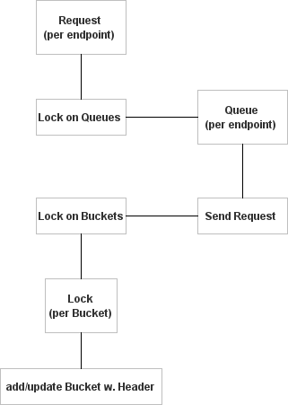
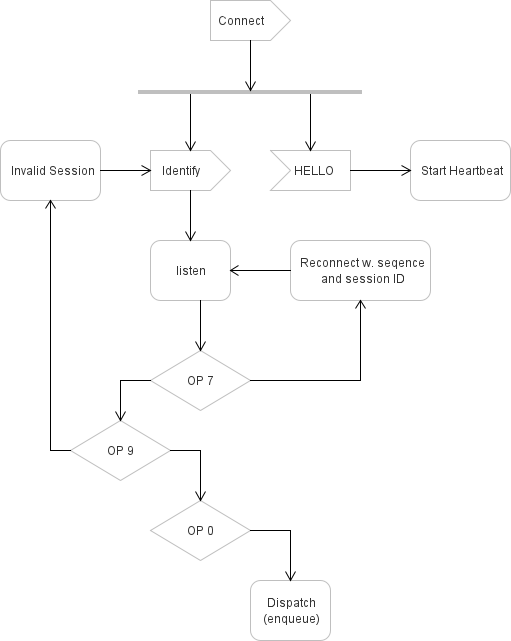
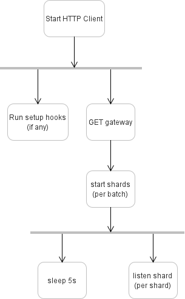

This document is an explanation and reference for ScurryPy's internal architecture. It assumes familiarity with Discord bots, async Python, and Discord's API surface. ScurryPy is a discord API wrapper written in Python that aims to provide clarity over magic. Even though other libraries have already implemented it, there are plenty of technical accomplishments that help ScurryPy stand out from other trending libraries; most notably, the core implementation is intentionally minimal and understandable.

## Introduction

ScurryPy is effective because it does not assume what the user needs nor does it try to *guess* what the user wants to do. All classes have clearly set boundaries for what they do so there is no need for annotations. As a result, ScurryPy is *modular* in that it provides the building blocks (guided by Discord's API). These are just the highlights of what *clarity over magic* can bring to the table. 

This writeup will cover the main parts of ScurryPy including the HTTP and rate limiting, Gateway logic and sharding, the role of the Bot Client, and the role of `JsonQuery`. Each section will have a mental map to help visualize steps. The goal of this writeup is that the reader walks away with a better understanding how clarity over magic leads to better software and how to implement Discord's difficult features.

## HTTP Client

The HTTP client is responsible for queuing, sending, and returning requests. This involves executing requests while proactively respecting Discord's rate limits. No fancy abstractions or layers of indirection. The client does this by working through the following steps:

*Figure 1: HTTP Client Mental Map*

1. Send request with a method (GET, POST, PUT, PATCH, or DELETE) to a route path (e.g., "/channels/123/messages").
2. The request is put into a queue based on this route path.
    * A lock coordinates updates to the dictionary that maps route paths to their queues.
    * Each queue has a dedicated worker to handle the request.
3. The worker sends the HTTP request and waits for Discord's response.
4. Using the bucket ID from Discord's response, update or create the bucket's rate limit info.
    * A global lock guards the bucket registry, with a dedicated lock per bucket ID for updates.
    * If the rate limit is exhausted (no remaining requests), then create a sleep task. This is *proactive* rate limiting to prevent 429s from ever occurring.
    * If another request targets the same bucket, it waits for the sleep task to finish.

!!! tip "Key Idea"
    Each route path gets its own queue and worker, and each worker enforces proactive rate limiting using Discord's bucket replies.

## Gateway Client

The Gateway Client is responsible for maintaining a connection to Discord's gateway and sending/receiving payloads. This includes the entire gateway lifecycle including connecting, receiving HELLO, identifying, receiving and queueing events, and reconnection. Because the gateway client handles reconnection, all that's needed when applying this class is spawning the needed number of shards at the rate of the max concurrency as recommended by Discord. Each shard runs as an independent asyncio task on the same event loop (not a thread or process).

!!! note "Shard Coordination"
    Need to know what shard an event came from? Use Discord's [formula](https://discord.com/developers/docs/events/gateway#sharding-sharding-formula): `(guild_id >> 22) % shard_count`.

*Figure 2: Gateway Client Mental Map*

Let's dig into the steps of the mental map:

1. Connect to the gateway with the URL provided by the `GET /gateway/bot` request.
2. Await the HELLO event Discord sends upon connection.
    * Use this to set heartbeat intervals and initialize the sequence number.
    !!! note "Adding a Jitter"
        Add a "jitter" for the first heartbeat so that Discord is not overwhelmed with a heartbeat from every spawned shard at once.
    * This is when the heartbeat task is started to keep the session alive.
3. Send IDENTIFY through the websocket.
4. Now, it's about listening to certain OP codes. *Only OP codes that impact the connection state are listed*.
    * OP 0: dispatch. Enqueue this for the core Bot Client event dispatcher to pick up.
    * OP 7: a disconnect occurred and Discord wants to RESUME.
    * OP 9: a disconnect occurred causing the session to be invalid. Discord wants to start fresh and re-identify.
5. If Discord requests a reconnect, there are multiple conditions to consider:
    * receiving an OP 7 as described in step 4
    * disconnected with a close code that allows reconnection
    * disconnected with *no* close code
    * OP 9 with `d` set to `True`

!!! tip "Key Idea"
    Each connection or shard gets its own task to connect, identify, reconnect or re-identify if needed, listen to events, and eventually close.

## Bot Client

The Bot Client is responsible for orchestrating HTTP and gateway clients or shards, and running startup and shutdown hooks. It also provides thin helpers to create resources from events or models. The Bot Client is intentionally not a god object.

*Figure 3: Bot Client Mental Map*

1. Start the HTTP Client.
2. Run setup hooks (an array of callable functions). These hooks run once for the entire life cycle of the bot (even after reconnects).
3. Fetch the gateway info. This is where important start up info is obtained such as the total number of recommended shards, how many shards can be started concurrently, and the recommended gateway connect URL.
4. Based on the gateway info from step 3, fire an asyncio task to listen to *each* shard's event queue. Shards already started can start taking in events as soon as they are ready. A short delay per batch (currently 5 seconds) to respect Discord's gateway concurrency limits.

!!! tip "Key Idea"
    The Bot Client's sole purpose is to provide a thin abstraction layer between internals and the user-facing API.

## JSON Query

ScurryPy works directly with Discord's JSON payloads rather than converting them into Python objects. The `JsonQuery` class provides a small interface for navigating and interpreting these payloads while retaining the original JSON structure.

Instead of defining a Python representation for every Discord object, applications can query the fields they need directly. For example, `event.get('user.username').value` retrieves a username nested within an event payload, while `event.get('user.id', int).value` retrieves and converts an ID.

This keeps Discord's payload as the source of truth. New or previously unsupported fields can be accessed without requiring a new model, converter, or ScurryPy release.

!!! note "Discord Payloads"
    URL parameters when connecting to Discord's gateway set the stage for how Discord should send its payloads. ScurryPy defaults to `?v=10&encoding=json` to receive a string formatted like a JSON. Then the payload is converted to a dictionary with `json.loads`.

1. The `get` function navigates through Discord's JSON using a dot-separated path and returns the selected value.
2. The `get` function can also interpret the selected value as a requested type or through a supplied conversion function.
3. Because the original payload remains intact, applications can access fields without requiring ScurryPy to define a corresponding Python object.

!!! tip "Key Idea"
    `JsonQuery` keeps Discord's JSON as the source of truth while providing explicit tools for navigating and interpreting it.

## Conclusion

Because every subsystem is small, explicit, and self-contained, extending ScurryPy is almost trivial: add a model, add a resource, and use the HTTP client directly. Users can prototype new Discord features the day they release, build custom caching, or omit caching entirely. The library does not fight the user. That's the benefit of clarity over magic.

