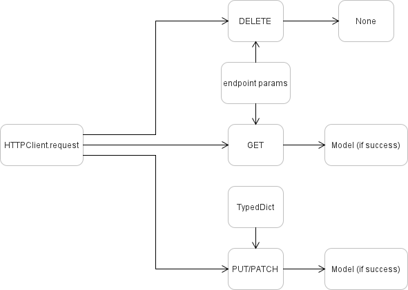

---
hide:
  - navigation
---

# Why ScurryPy?
---

This page explores *why* ScurryPy's technical accomplishments are beneficial to contributors and its users.

## No Magic
---

Scurrypy does not require decorators for wiring logic. Both decorators and manual registration are available, retaining flexibility without assuming how a user wants to structure code. What's the gain for users? *Flexibility, composability, and control*. Without decorators, users are not fighting expected parameters for their functions, and maintainers are not developing dependency injection just to have flexible parameters. This offers composability: beyond ScurryPy's simple contract, you are free to compose your code how *you want*, not how maintainers expect you to compose code. This offers control: build what you want, how you want, when you want.

## Self-documenting
---

ScurryPy has thorough documentation. All fields (with the exception of some self-explanatory types) are documented either from Discord's docs directly or paraphrased for easier understanding. How does this benefit users and maintainers alike? You shouldn't need to keep Discord's docs open while using ScurryPy. One less tab to keep up with!

## No Codependency
---

All classes are loosely coupled and therefore do not have codependency or circular dependency. How does this benefit users and maintainers alike? The source code is easier to read and follow.

## Consistent Patterns
---

The main core objects that will be used by users and maintainers is the [`HttpClient`][scurrypy.core.http.HttpClient]. Whether you are using the wrapped resources or using an endpoint directly, you will certainly be using `HttpClient`. ScurryPy as flow in its requests. See the following mental map for how ScurryPy imagines its request system.

*Figure 1: Request Client Mental Map*

How does this benefit users and maintainers? Patterns in ScurryPy are simple, predictable, and easy to reason about.

## Lightweight Core
---

ScurryPy's core is minimal and understandable. It means you can understand ScurryPy in an afternoon! No sprawling codebase to navigate or hidden surprises; just clean, traceable code. Or you can read the [technical writeup](internals/technical_writeup.md) to get a more thorough explanation. How does this benefit users and maintainers? For maintainers, the faster you understand a library, the faster you can get to work! For users, especially power users, this gives you quick access to Flexibility, composability, and control without burning out on learning how ScurryPy works.

## Easy-to-maintain Docs
---

The docs are always up to date with ScurryPy's rapid development. With every great project comes a great set of docs that is honest, comprehensive, and correct.

## Emergent Extensibility
---

ScurryPy introduced Addon patterns. Addons are classes that subscribe to the client with callbacks to its own methods. That's all an addon is!
See the [addons pattern page](getting_started/addons.md) for more!

## Quick Summary
---

Need a tl;dr? Check out the table below for a quick summary on what ScurryPy offers!

| Feature | User Value |
| :------ | :--------- |
| No Magic | Flexibility, control, composability |
| Self-documenting | Don't need Discord docs open constantly |
| No circular imports | Can read and understand code |
| Consistent patterns | Faster learning curve, less memorization |
| Lightweight core | Confidence it won't break mysteriously |
| Easy-to-maintain docs | Docs stay current, users stay informed |
| Emergent extensibility | Build exactly what you need |

